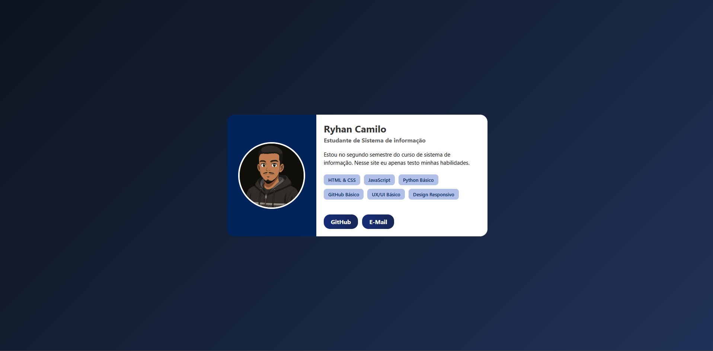

# 🌐 Card Simples - Ryhan

Um site pessoal desenvolvido para apresentar minhas informações, habilidades e formas de contato de maneira simples, moderna e totalmente responsiva.  
Este projeto foi criado com o objetivo de **testar e aprimorar minhas habilidades em HTML, CSS e design front-end**.

---

## 🧠 Sobre o Projeto

É uma página estilo **cartão de perfil (profile card)**, que reúne:
- Uma **foto de perfil** interativa.
- **Informações pessoais** e um pequeno texto de introdução.
- Uma **lista de habilidades técnicas**.
- **Links de contato**, como GitHub e E-mail.

O design foi pensado para ser **minimalista, elegante e adaptável a diferentes dispositivos**, mantendo uma boa legibilidade e harmonia visual.

---

## 🧩 Estrutura do Projeto

O projeto é composto apenas por **HTML** e **CSS puro**, sem uso de frameworks externos.
```bash
📁 card-simples/
│
├── index.html # Estrutura principal do site
├── style.css # Estilos visuais e responsividade
└── img/
└── foto.jpg # Imagem de perfil exibida no card
```


---

## 🎨 Principais Recursos

- 🖼️ **Foto de perfil** com efeito de flutuação (`hover`)
- 📋 **Informações pessoais** e resumo do autor
- 💡 **Lista de habilidades** com destaque visual
- 🔗 **Botões interativos** com gradiente e animação
- 📱 **Design responsivo** usando `flexbox` e `@media queries`
- 🌈 **Cores suaves e modernas** com fundo em degradê

---

## ⚙️ Tecnologias Utilizadas

| Tecnologia | Uso Principal |
|-------------|----------------|
| **HTML5** | Estrutura do site |
| **CSS3** | Estilização e animações |
| **Flexbox** | Layout responsivo e alinhamento |
| **Media Queries** | Adaptação para dispositivos móveis |

---

## 📱 Responsividade

O site se adapta automaticamente a diferentes tamanhos de tela:
- 💻 **Desktop:** layout horizontal com imagem e informações lado a lado.  
- 📱 **Tablet e Mobile:** layout vertical com centralização dos textos e botões.

---

## 🚀 Como Visualizar

### 🖥️ Opção 1 — Clonando o Repositório e abra o arquivo **index.html**
```bash
git clone https://github.com/SEU-USUARIO/ryhan-codes.git
```

### 🌍 📷 Prévia do Projeto


